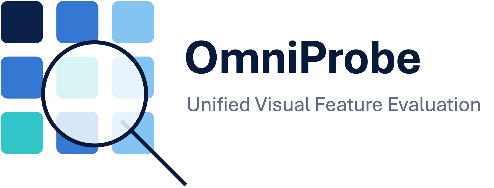

<p align="center">
  
</p>

**A unified framework for evaluating visual features across dense tasks**

[](https://www.python.org/) [](./LICENSE)

OmniProbe gives 25+ families of visual foundation models a *single* command-line and Python interface for probing their features on correspondence, depth, surface-normal, segmentation, pose, tracking, and classification tasks.

- [Highlights](#highlights)
- [Installation](#installation)
- [Quickstart](#quickstart)
- [What's available](#whats-available)
  - [Tasks](#tasks)
  - [Backbones](#backbones)
- [Usage](#usage)
  - [Command line](#command-line)
  - [Python API](#python-api)
  - [Configs](#configs)
- [Datasets \& paths](#datasets--paths)
- [Contributing](#contributing)
- [Citation](#citation)
- [License \& acknowledgments](#license--acknowledgments)


## Highlights

- **One CLI for every task** — `python -m omniprobe.run task=<task> backbone=<backbone>` has the same shape whether you are matching keypoints or training a depth probe.
- **92 backbone configs** spanning 25+ model families, all behind one feature interface (`dense` / `cls` / `gap` outputs).
- **7 task families** — correspondence (SPair, SOCO, NAVI, ScanNet, AP-10K), depth, surface normals, segmentation (ADE20K), 3D object pose (ImageNet3D), tracking (TAP-Vid), and kNN / linear classification (ImageNet).
- **Configurable via [Hydra](https://hydra.cc/)** — override any setting from the CLI, or compose your own config layers.
- **CLI *or* Python** — run from the shell or call `omniprobe.evaluate(...)` directly.


## Installation

We use [uv](https://docs.astral.sh/uv/) for dependency management.

```bash
# 1. Install uv: https://docs.astral.sh/uv/getting-started/installation/

# 2. Create the environment with core dependencies (Python 3.12, PyTorch cu121)
uv sync

# 3. (Optional) configure cache paths for your machine
cp .env.example .env   # then edit HF_HOME / TORCH_HOME / CUDA_HOME
```

Some backbones need extra dependencies — install only what you use:

| Extra | Enables |
|-------|---------|
| `clip` | CLIP / OpenCLIP / ConvNeXt backbones (`open-clip-torch`) |
| `sam` | SAM backbone (`segment-anything`) |
| `diffusion` | DIFT / Stable Diffusion backbone (`diffusers`) |
| `xformers` | memory-efficient attention |
| `knn` | faiss for ImageNet kNN eval |
| `data-processing` | dataset preprocessing helpers |
| `dev` | pytest + pre-commit |
| `all` | `clip,sam,diffusion,xformers,data-processing` |

```bash
uv sync --extra clip          # one extra
uv sync --extra all           # everything above
```

<details>
<summary>pip fallback</summary>

```bash
pip install torch torchvision --index-url https://download.pytorch.org/whl/cu121
pip install -e ".[all,knn,dev]"
```
</details>

The code for backbones that build on external repositories (CroCo, I-JEPA, Perception, VGGT, MetaCLIP, PIXIO) is **vendored** under `omniprobe/models/vendor/` — there are no git submodules to fetch. Those models only need their checkpoint files downloaded (see [docs/MODELS.md](./docs/MODELS.md)); DINO/DINOv2/DINOv3, C-RADIO, DUNE and V-JEPA 2 are pulled from `torch.hub` on first use.


## Quickstart

Every evaluation runs through one entrypoint:

```bash
python -m omniprobe.run task=<task> backbone=<backbone> [task.mode=<mode>]
```

A minimal SOCO correspondence run with a hub-loaded DINOv2 backbone (no checkpoint files needed; you only need the SOCO dataset configured — see [Datasets & paths](#datasets--paths)):

```bash
python -m omniprobe.run task=correspondence_soco backbone=dinov2_b14 task.mode=nn
```

The same call from Python:

```python
import omniprobe

result = omniprobe.evaluate(
    task="correspondence_soco",
    backbone="dinov2_b14",
    mode="nn",
)
print(result)
```


## What's available

The CLI is the live source of truth — these always reflect the installed configs:

```bash
omniprobe --list-tasks        # or: python -m omniprobe.run --list-tasks
omniprobe --list-backbones
```

### Tasks

| Family | Datasets |
|--------|----------|
| Correspondence | SPair-71k, SOCO, NAVI, ScanNet, AP-10K |
| Depth | NYU, NAVI |
| Surface normals | NYU, NAVI |
| Segmentation | ADE20K |
| Pose | ImageNet3D |
| Tracking | TAP-Vid DAVIS |
| Classification | ImageNet |

### Backbones

92 configs across the families below. Pass any config name as `backbone=<name>`; see **[docs/MODELS.md](./docs/MODELS.md)** for the full per-config table (weight source and supported output modes).

| Family | Example configs | Weights |
|--------|-----------------|---------|
| DINO / DINOv2 | `dino_b16`, `dinov2_b14`, `dinov2_l14`, `dinov2_b14_reg` | torch.hub |
| DINOv3 | `dinov3_vitb16`, `dinov3_vitl16`, `dinov3_convnext_base` | torch.hub + ckpt |
| C-RADIO | `c_radio_3_b`, `c_radio_4_h` | torch.hub |
| DUNE | `dune_vitb14`, `dune_vits14_448` | torch.hub |
| V-JEPA 2 | `vjepa2_1_base`, `vjepa2_1_large` | torch.hub / ckpt |
| CLIP / OpenCLIP | `clip_b16`, `clip_l14`, `openclip_vitl14_laion2b` | open_clip / ckpt |
| ConvNeXt | `clip_convnext`, `convnext_in22k` | open_clip / timm |
| DeiT-III | `deit3_b16`, `deit3_l16` | timm |
| iBOT | `ibot_b16`, `ibot_l16_in22k` | local ckpt |
| MAE | `mae_b16`, `mae_l16`, `mae_h14` | HF Hub |
| SigLIP | `siglip_b16`, `siglip_l16` | timm |
| SAM | `sam_base`, `sam_large`, `sam_huge` | local ckpt |
| MetaCLIP 2 | `metaclip2_vitb16`, `metaclip2_vitl14` | vendored + ckpt |
| PIXIO | `pixio_vitb16`, `pixio_vitl16` | vendored + ckpt |
| Perception | `perception_b16_512`, `perception_l14_448` | vendored + ckpt |
| CroCo | `crocov2` | vendored + ckpt |
| I-JEPA | `ijepa_vith16_448` | vendored + ckpt |
| VGGT | `vggt`, `vggt_dino` | vendored + ckpt |
| DIY-SC | `dinov2_b14_diy_sc` | torch.hub |
| MiDaS | `midas_l16` | torch.hub |
| DIFT / Stable Diffusion | `dift_sd21`, `dift_sd15` | HF Hub (`diffusion` extra) |
| LVLM visual encoders | `qwen2_5_vl_7b`, `internvl3_5_8b`, `llava_ov_7b` | HF Hub (`transformers`) |


## Usage

### Command line

```bash
# First configure dataset roots and (optionally) caches — see "Datasets & paths".

# Correspondence
python -m omniprobe.run task=correspondence_spair backbone=dino_b16 task.mode=nn
python -m omniprobe.run task=correspondence_soco backbone=dinov2_b14 task.mode=soft_argmax
python -m omniprobe.run task=correspondence_navi backbone=dino_b16
python -m omniprobe.run task=tracking_tapvid backbone=dinov2_b14

# Dense probes / segmentation
python -m omniprobe.run task=depth backbone=dino_b16
python -m omniprobe.run task=snorm backbone=dino_b16
python -m omniprobe.run task=segmentation_ade20k backbone=dinov2_b14 task.mode=train

# ImageNet classification
python -m omniprobe.run task=classification_imagenet_knn    backbone=dinov2_b14 task.data_root=/path/to/imagenet
python -m omniprobe.run task=classification_imagenet_linear backbone=dinov2_b14 task.data_root=/path/to/imagenet
```

### Python API

```python
omniprobe.evaluate(
    task,                 # task name, e.g. "correspondence_spair"
    backbone,             # backbone config name, e.g. "dinov2_b14"
    mode="default",       # task mode (see --list-tasks)
    device="auto",        # "cuda" | "cpu" | "auto"
    **task_overrides,     # forwarded onto cfg.task, e.g. data_root=...
)
```

```python
import omniprobe

print(omniprobe.available_backbones())   # all backbone config names
print(omniprobe.available_tasks())       # all task names

result = omniprobe.evaluate(
    task="correspondence_soco",
    backbone="dinov2_b14",
    mode="linear_probe",
    data_root="/path/to/SOCOv1",
)
```

### Configs

Configuration lives in three Hydra layers:

1. **Runtime** — [`configs/run.yaml`](./configs/run.yaml): default `task`, `backbone`, and runtime-only settings such as `device`.
2. **Flat task defaults** — [`configs/task/`](./configs/task): one file per task (e.g. `correspondence_spair.yaml`, `depth.yaml`). The best place to change the defaults users see when running `python -m omniprobe.run`.
3. **Canonical script configs** — [`configs/`](./configs): the per-script Hydra config trees (e.g. `eval_correspondence_spair.yaml`, `train_depth.yaml`) that script-backed tasks compose and then override.

Practical rule:

- Change `configs/task/<task>.yaml` for flat-runtime defaults.
- Change `configs/<script_config>.yaml` for a script's internal config tree.
- Use Hydra CLI overrides for one-off runs:

```bash
# One-off dataset root override
python -m omniprobe.run task=correspondence_spair backbone=dinov2_b14 \
  task.data_root=/path/to/SPair-71k

# Change task mode and training settings
python -m omniprobe.run task=correspondence_soco backbone=dinov2_b14 \
  task.mode=linear_probe task.train.epochs=20 task.train.lr=0.0005
```

Under the hood, most tasks delegate to evaluation scripts in `omniprobe/scripts/` (via their `run_task(cfg)` function); `classification_imagenet_knn` and `classification_imagenet_linear` are implemented natively in `omniprobe/tasks/`. The runtime entrypoint is [`omniprobe/run.py`](./omniprobe/run.py) and the task registry lives in [`omniprobe/tasks/__init__.py`](./omniprobe/tasks/__init__.py).


## Datasets & paths

Each task reads its dataset root from an environment variable, defaulting to `data/<dataset>` — the layout produced by the download guide. Following **[data_processing/README.md](./data_processing/README.md)** therefore works out of the box from the repo root; override the variable to point elsewhere:

```bash
export SOCO_ROOT=/path/to/SOCOv1   # optional; defaults to data/SOCOv1
python -m omniprobe.run task=correspondence_soco backbone=dinov2_b14 task.mode=nn
```

Downloaded checkpoints default to `checkpoints/` (override with `OMNIPROBE_PRETRAINED_MODELS`); backbone code that builds on external repositories is vendored under `omniprobe/models/vendor/`. See [docs/MODELS.md](./docs/MODELS.md) for the per-backbone checkpoint env vars (`CROCO_CKPT`, `VGGT_CKPT`, …).


## Contributing

Contributions of new backbones, tasks, and datasets are welcome.

- **Add a backbone:** use [`omniprobe/models/siglip.py`](./omniprobe/models/siglip.py) as a template (it implements the `BackboneProtocol` from `omniprobe/models/utils.py`), then add `configs/backbone/<name>.yaml` with a `_target_` pointing at your class, and register its capability contract in `omniprobe/models/contracts.py`.
- **Add a task:** register it in `omniprobe/tasks/__init__.py` and add a `configs/task/<task>.yaml`.
- **Run the tests:** `pytest tests/ -q` (install the `dev` extra first).

See **[docs/DEVELOP.md](./docs/DEVELOP.md)** for a more detailed developer guide.


## Citation

If you use OmniProbe in your research, please consider giving a star ⭐ and cite:

```bibtex
@article{duenkel2026soco,
  title         = {SOCO: Benchmarking Semantic Object Correspondence in Vision Foundation Models},
  author        = {D{\"u}nkel, Olaf and Sunagad, Basavaraj and Wang, Haoran and
                   Hoffmann, David T. and Theobalt, Christian and Kortylewski, Adam},
  journal       = {arXiv preprint arXiv:2605.31597},
  year          = {2026}
}
```


## License & acknowledgments

OmniProbe is released under the [MIT License](./LICENSE).

This project builds on several open-source works; see [docs/THIRD_PARTY_LICENSES.md](./docs/THIRD_PARTY_LICENSES.md) for full attribution and their licenses. We especially thank [Probing the 3D Awareness of Visual Foundation Models](https://arxiv.org/abs/2404.08636) (CVPR 2024), whose implementation this framework heavily builds upon.
